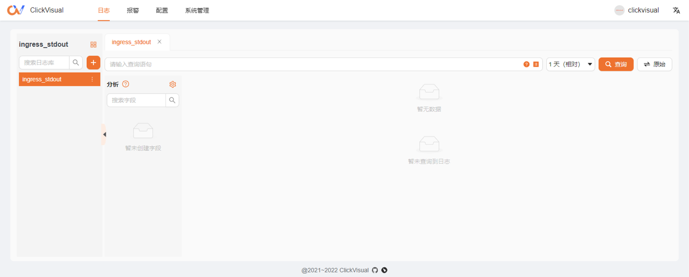
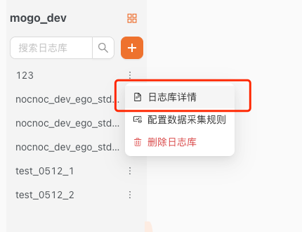
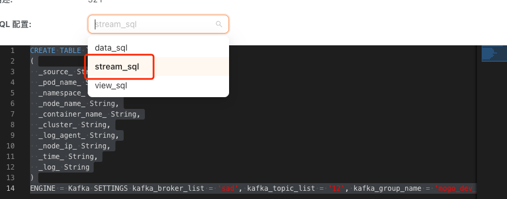
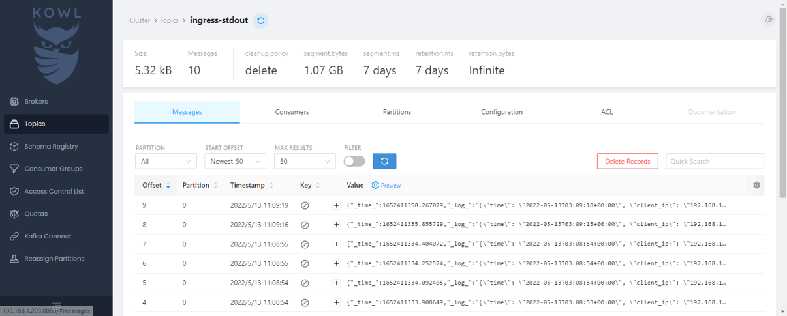
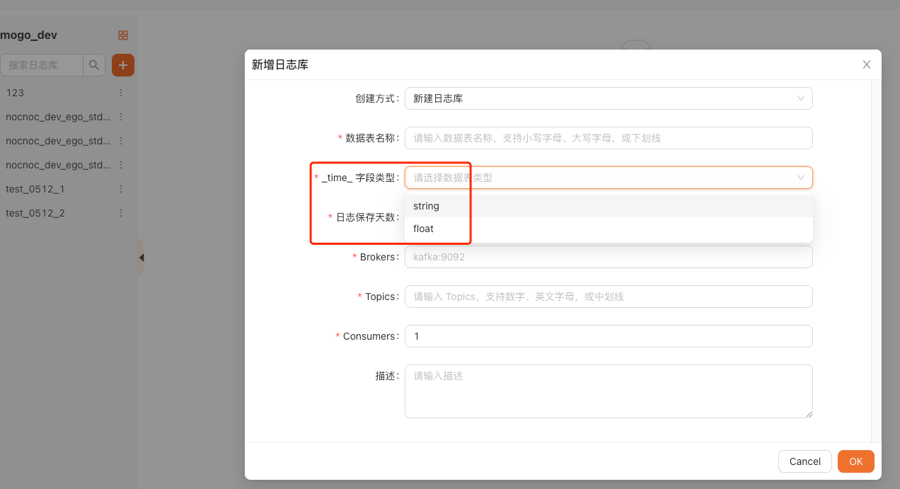

# 常见问题

## 1. 服务启动后跳转到 localhost

### 现象


### 解决
服务配置中包含地址设置，调整这个地址即可
```toml
[app]
rootURL = "http://localhost:19001"
 ```

配置文件对应地址
- docker：/data/all-in-one/clickvisual/config/docker.toml
- 代码启动：/config/default.toml

## 2. Kafka 里面有数据但是 ClickVisual 中没有日志

### 现象
在 kowl 中能看到 topics 是有数据的，但是在 clickvisual 创建了 clickhouse 实例，也在日志中添加了数据库列表并新增了日志库，但是没有数据出来。我这么看数据有没有到 clickhouse。


### 排查






查看这个 steam_sql 的结构，确保如下图所示在 kafka 里面传输的日志数据是以上结构的子集。

例如上面这两个就无法对应，steam_sql 中的 _time_ 是 String，但是 kafka 里面的是 Float，无法正常消费。

这个配置在这里设置


