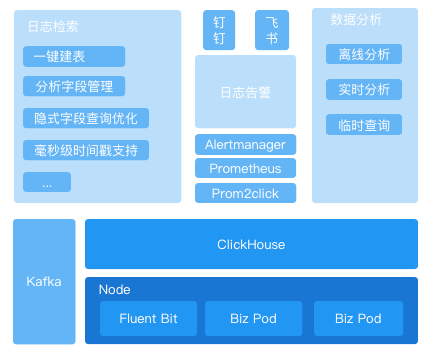
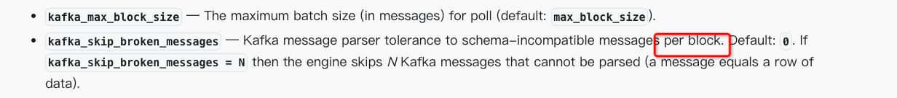

# Q&A

## clickvisual性能测试报告？特别是与ELK在同等规模下的对比测试。
ClickVisual 的定位是 ClickHouse 的 GUI 工具，帮助用户快速搭建 ClickHouse 的最佳实践。  
性能相关的测试对比可以关注 ClickHouse 的 ES 的差异: 
[https://mp.weixin.qq.com/s/hP0ocT-cBCeIl9n1wL_HBg](https://mp.weixin.qq.com/s/hP0ocT-cBCeIl9n1wL_HBg)
[https://mp.weixin.qq.com/s/n2I94X6tz2jOABzl1djxYg](https://mp.weixin.qq.com/s/n2I94X6tz2jOABzl1djxYg)

## 哪些组件是必需？
可以参考这个图，clickvisual 大致上分为以下三个模块，每个模块使用依赖的组件不同，可以选择使用。
- 日志检索
- 日志告警
- 数据分析



## 组件是否可以使用已有的，而不是新建。
可以使用已有组件，不需要完全新建。例如 ClickHouse 使用已有的组件时进行数据库创建操作，可能出现重名问题，此时 ClickVisual 会对数据库创建失败。

## 目前只能测试使用？上生产环境没有集群版？
石墨内部已在生产环境使用，自建集群和阿里云集群都在正常使用。

## 目前哪些企业已使用该日志平台？
可以参考这个 issues，由使用者自发填写 [https://github.com/clickvisual/clickvisual/issues/154](https://github.com/clickvisual/clickvisual/issues/154)

## 服务启动后跳转到 localhost

现象


解决

服务配置中包含地址设置，调整这个地址即可
```toml
[app]
rootURL = "http://localhost:19001"
 ```
- 此处的rootURL 必须有http:// 前缀，不然会是一个非法的url不能使用

配置文件对应地址
- docker：/data/all-in-one/clickvisual/config/docker.toml
- 代码启动：/config/default.toml

## Kafka 有数据 ClickVisual 中没日志

现象

在 kowl 中能看到 topics 是有数据的，但是在 ClickVisual 创建了 ClickHouse 实例，也在日志中添加了数据库列表并新增了日志库，但是没有数据出来。我这么看数据有没有到 ClickHouse。


排查


查看这个 steam_sql 的结构，确保如下图所示在 kafka 里面传输的日志数据是以上结构的子集。

例如上面这两个就无法对应，steam_sql 中的 `_time_` 是 String，但是 kafka 里面的是 Float，无法正常消费。

这个配置在这里设置


解决

1. 调整 kafka 采集数据内容，保证 kafka 采集数据字段为 stream 表的字段的子集
2. 调整 `kafka_skip_broken_messages` 参数，跳过格式异常的数据



## database.sql的脚本里面没有建表的sql

服务启动成功后访问 http://localhost:19001 可以初始化数据库
