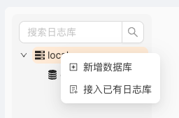
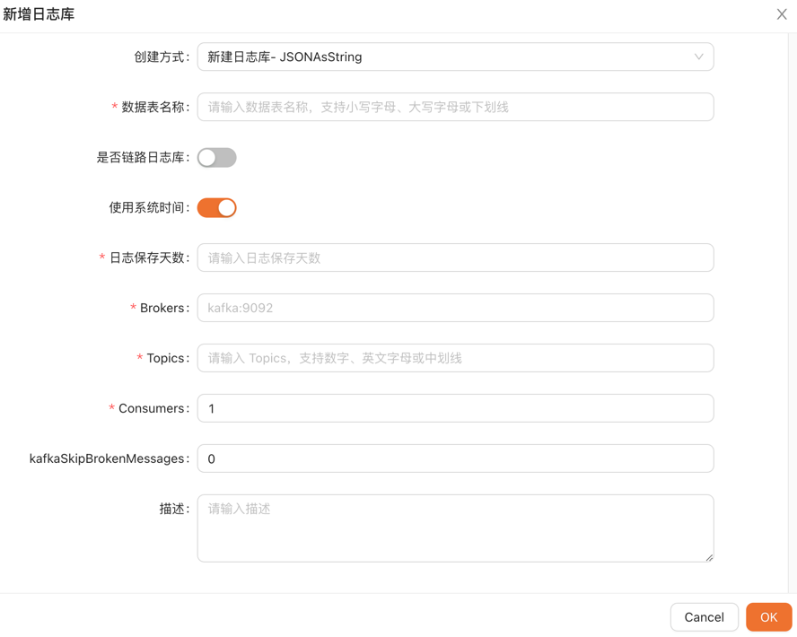
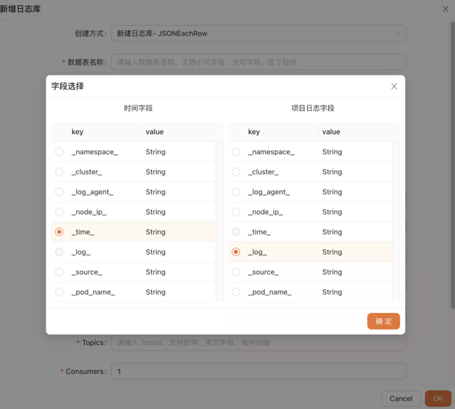
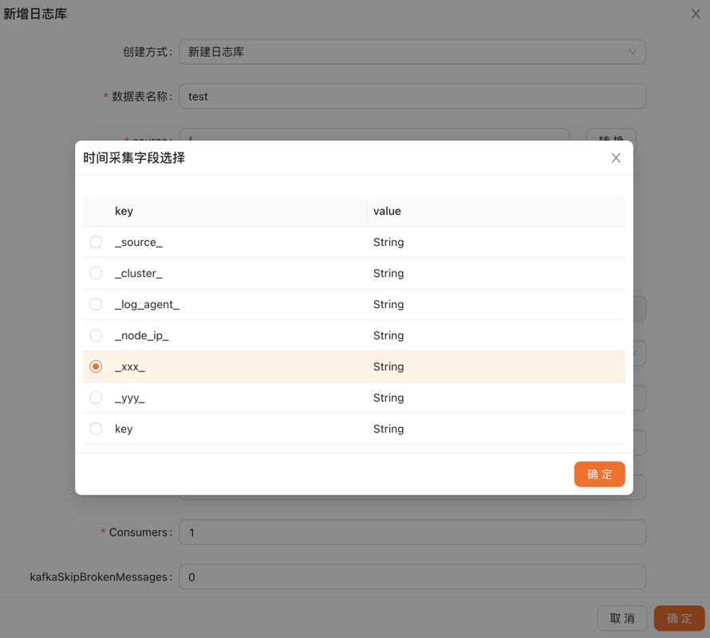
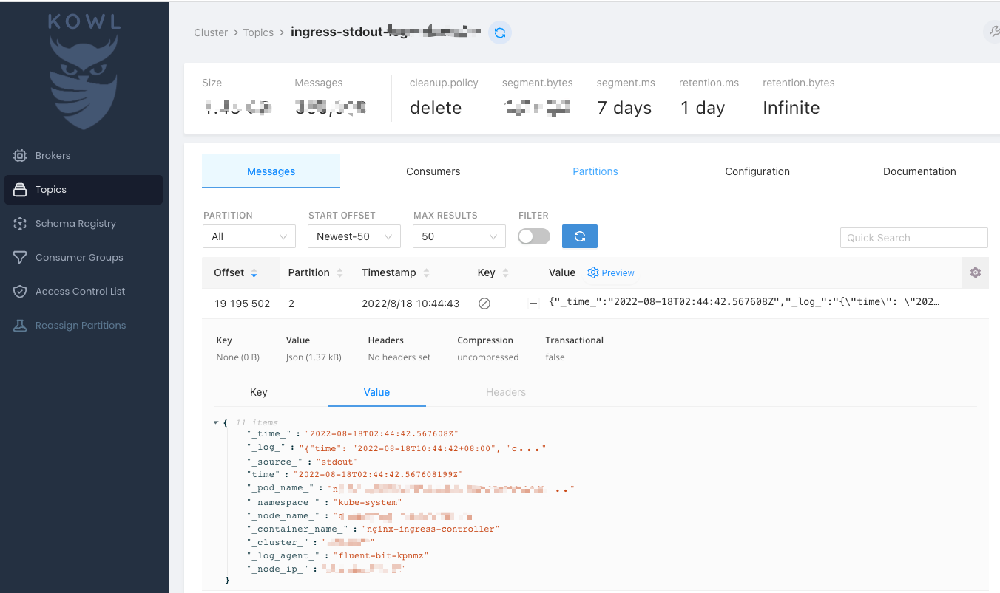
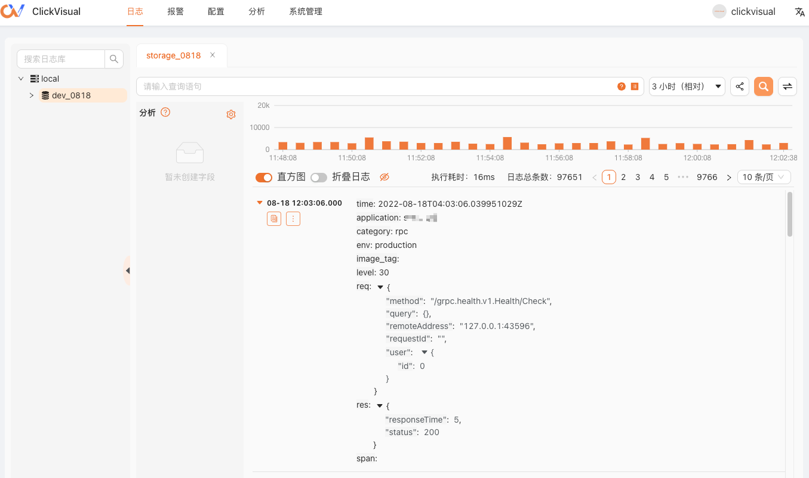

# 快速上手
本文主要是帮助你快速了解 ClickVisual，查询你的日志信息。想要更多了解 ClickVisual，请参考：什么是 ClickVisual。

## 第一步：安装 ClickVisual

ClickVisual 可以安装在不同种类的操作系统上，并且可以使用二进制、Docker 形式安装，请参考：安装介绍。

## 第二步：初始化 ClickVisual 数据库
初次安装 ClickVisual，需要初始化数据库，访问 http://localhost:19001/install/init  
对已有数据库进行版本更新的情况下，访问 http://localhost:19001/api/v1/migration

点击『数据库初始化』按钮，等待片刻，直至页面提示初始化完成。

## 第三步：登录
打开浏览器并访问：http://localhost:19001/user/login。  
在登录页面，输入默认账号/密码：clickvisual/clickvisual。

## 第四步：添加 ClickHouse 实例
在顶部导航栏，访问 系统设置 -> 实例管理，准备添加新的 ClickHouse 实例。  

## 第五步：添加数据库
回到日志页面，右键点击实例，弹出菜单，创建数据库。  

## 第六步：创建日志库

- source：部分是 kafka 中采集的日志数据（JSON）
- Brokers：填入 docker 中的 kafka 配置：kafka:9092
- Topic：kafka 中采集日志的 Topic Name 是 ingress-stdout

点击`转换`按钮，选择两个关键字段
- timeField 为日志采集时间戳字段，类型必须是 string 或者 float
- rawLogField 为完整的日志原数据

## 第七步：模拟插入一条日志

## 第八步：查询日志
访问 http://localhost:19001/query ，此时我们已可以看到日志。

增加分析字段
由于尚未创建分析字段，所有字段的背景色都是灰色的，此时我们只可以使用模糊搜索，但性能不是很好，所以我们需要按照下图创建分析字段。

创建完分析字段后，我们在按照第五步插入几条日志，就可以根据分析字段查看日志：

