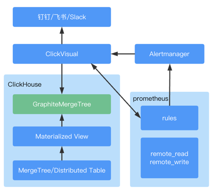
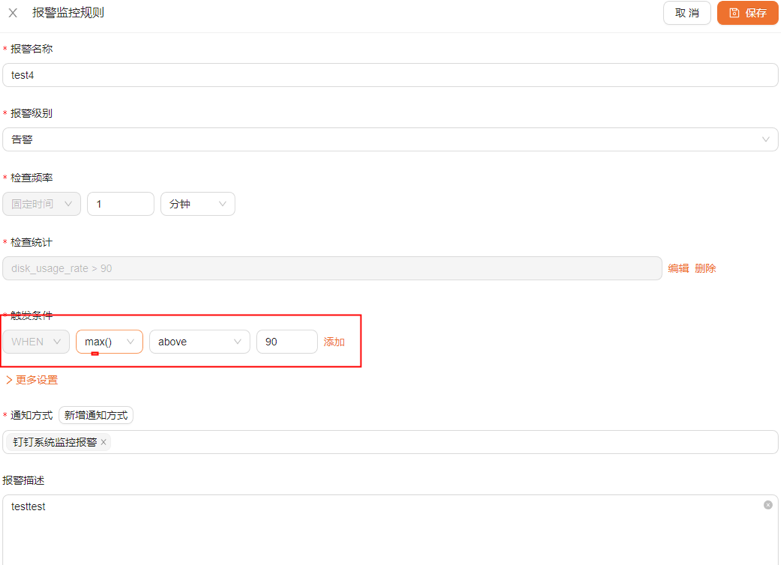
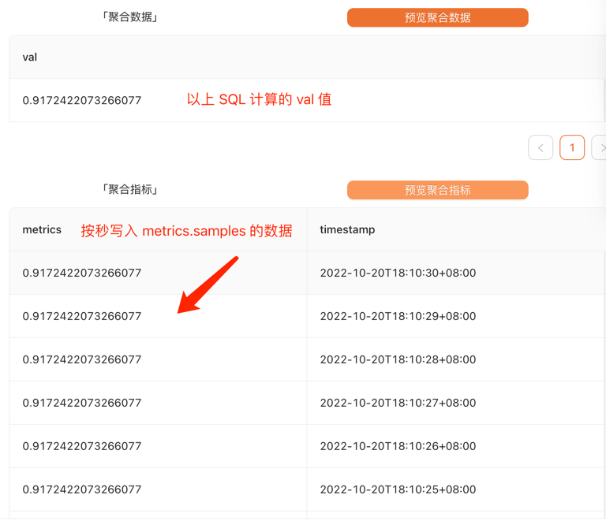
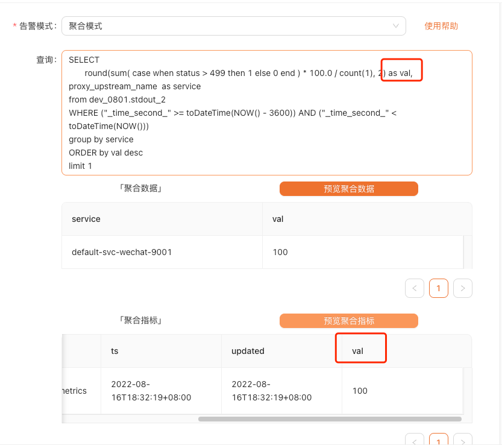

# 日志告警

`可用版本 >= 0.2.1`

## 架构说明



## 使用说明

1. 在 ClickHouse 中产生对应数据表的 Materialized View，作用是将数据按照配置的规则以秒为单位录入 metrics.samples 表中
2. 产生的 Prometheus 告警规则写入配置的文件或者 configmap 中
3. Prometheus 读取 metrics.samples 的数据，并根据告警规则产生告警，推送到 Prometheus AlertManager
4. Prometheus AlertManager 通过 webhook 推送到 clickvisual，再由 clickvisual 分发到钉钉

## 集群部署

可参考[https://github.com/clickvisual/clickvisual/tree/master/data/k8s/prometheus](https://github.com/clickvisual/clickvisual/tree/master/data/k8s/prometheus) 中的配置。

### ClickHouse 配置

新增`graphite_rollup` 配置，配置路径可以参考，根据 clickhouse 的版本不通略有区别，具体以官方指导配置为准。


```xml
<yandex>
  <graphite_rollup>
    <path_column_name>tags</path_column_name>
    <time_column_name>ts</time_column_name>
    <value_column_name>val</value_column_name>
    <version_column_name>updated</version_column_name>
    <default>
      <function>sum</function>
      <retention>
        <age>0</age>
        <precision>1</precision>
      </retention>
      <retention>
        <age>360</age>
        <precision>60</precision>
      </retention>
      <retention>
        <age>3600</age>
        <precision>300</precision>
      </retention>
      <retention>
        <age>86400</age>
        <precision>3600</precision>
      </retention>
    </default>
  </graphite_rollup>
</yandex>
```

需要创建 metrics.samples 表，依赖 `graphite_rollup` 配置

```sql
CREATE DATABASE IF NOT EXISTS metrics;

CREATE TABLE IF NOT EXISTS metrics.samples [ON CLUSTER cluster]
(
    date Date DEFAULT toDate(0),
    name String,
    tags Array(String),
    val Float64,
    ts DateTime,
    updated DateTime DEFAULT now()
)ENGINE = GraphiteMergeTree(date, (name, tags, ts), 8192, 'graphite_rollup')
  [PARTITION BY expr]
  [ORDER BY expr]
  [SAMPLE BY expr]
  [SETTINGS name=value, ...]
```

### Prometheus 配置

需要支持配置热更新，[参考文档](https://songjiayang.gitbooks.io/prometheus/content/qa/hotreload.html)

> 从 2.0 开始，hot reload 功能是默认关闭的，如需开启，需要在启动 Prometheus 的时候，添加 --web.enable-lifecycle 参数。

启动文件里面增加如下配置：

- clickvisual 为对应服务访问地址
- alertmanager 为对应服务访问地址

rule_files 中配置的路径需要与系统配置中下发路径一致

```yaml
global:
  evaluation_interval: "15s"
rule_files:
  - /etc/prometheus/rules/*.yaml
alerting:
  # 告警配置文件
  alertmanagers:
  # 修改：使用静态绑定
  - static_configs:
    # 修改：targets、指定地址与端口
    - targets: ["alertmanager:9093"]
remote_read:
  - url: "http://clickvisual:9201/read"
    read_recent: true
remote_write:
  - url: "http://clickvisual:9201/write"
    queue_config:
      capacity: 10000
      max_shards: 1
      max_samples_per_send: 500
```

### Prometheus AlertManager 配置

告警方式为 webhook，回调到 clickvisual 服务，修改 url 地址，保证可以正常访问 clickvisual 服务。

```yaml
route:
  group_by: ['alertname', 'cluster', 'service']
  group_wait: 30s
  group_interval: 5m
  repeat_interval: 10m
  receiver: webhook

receivers:
- name: 'webhook'
  webhook_configs:
  - url: 'http://clickvisual:19001/api/v1/prometheus/alerts'
```

### ClickVisual 配置

#### 启动配置

配置文件中增加如下配置，作用是让 Prometheus 远程读写 ClickHouse
- host:port 表示 prometheus 配置的 remote_read/remote_write 需要的 host:port
- 其余配置为 clickhouse 配置

```
[prom2click]
enable = true

[prom2click.dev]
host = "127.0.0.1"
port = 9201
clickhouseDSN = "tcp://127.0.0.1:9000"
clickhouseDB = "metrics"
clickhouseTable = "samples"
```

#### 系统设置

访问：系统设置 -> 实例管理

新增和编辑实例数据可以在 “更多设置” 中，可以看到如下配置，这个部分配置的作用是将告警规则下发到 Prometheus。

如果 Prometheus 采用本地配置文件方式启动，例如下面这个例子，则将文件路径配置为 `/etc/prometheus/rules`

```yaml
rule_files:
- /etc/prometheus/rules/*.yaml
```


## 报警消息推送效果


## 告警配置



- 检查频率：监控数据数据检测周期
- 检查统计：按照秒进行数据统计
  - 常规模式，统计符合规则数据条数
  - 聚合模式，记录 val 值
- 触发条件：对检查统计步骤计算的值进行规则检测后触发告警

比如以上例子，日志中每秒出现 disk_usage_rate>90 的日志总条数大于 90。

### 常规模式

在输入框部分填入 where 部分语句即可，点击预览后进入后续告警流程。

### 聚合模式

例如你需要配置一小时内 nginx 访问失败率的告警，SQL 语句如下所示：

```mysql
SELECT 
       round(sum( case when status > 499 then 1 else 0 end ) * 100.0 / count(1), 2) as val,
       proxy_upstream_name  as service
from ingress.ingress_stdout
WHERE ("_time_second_" >= toDateTime(NOW() - 3600)) AND ("_time_second_" < toDateTime(NOW()))
group by service
having  length(service) > 3 
ORDER by val desc
```

以上这个 SQL 会每秒触发一次，进行 val 计算

根据这个配置计算出来，metrics 是实际写入 metrics.samples 的值，即【触发条件】配置的目标数据



要求： 
- select 监控指标必须使用 `as val`
- 其他的语法为 clickhouse 语法 [参考文档](https://clickhouse.com/docs/zh/sql-reference/statements/select/)




