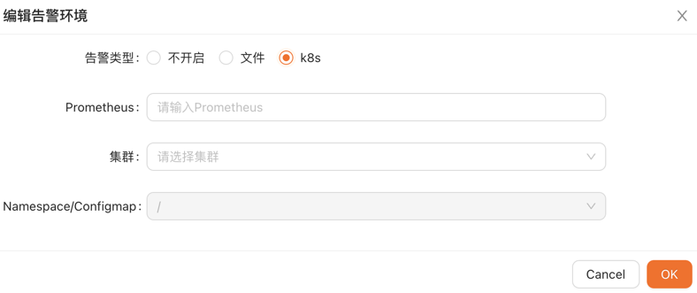

# 告警功能配置说明

`可用版本 >= 0.2.1`

## 架构说明


## 使用说明

1. 在 ClickHouse 中产生对应数据表的 Materialized View，作用是将数据按照配置的规则以秒为单位录入 metrics.samples 表中
2. 产生的 Prometheus 告警规则写入配置的文件或者 configmap 中
3. Prometheus 读取 metrics.samples 的数据，并根据告警规则产生告警，推送到 Prometheus AlertManager
4. Prometheus AlertManager 通过 webhook 推送到 ClickVisual，再由 ClickVisual 分发到钉钉

## 集群部署

可参考[https://github.com/shimohq/ClickVisual/tree/master/data/k8s/prometheus](https://github.com/shimohq/ClickVisual/tree/master/data/k8s/prometheus) 中的配置。

### ClickHouse 配置

新增`graphite_rollup` 配置，配置路径可以参考，根据 clickhouse 的版本不通略有区别，具体以官方指导配置为准。


```xml
<?xml version="1.0" ?>
<yandex>
    <graphite_rollup>
        <path_column_name>tags</path_column_name>
        <time_column_name>ts</time_column_name>
        <value_column_name>val</value_column_name>
        <version_column_name>updated</version_column_name>
        <default>
            <function>avg</function>
            <retention>
                <age>0</age>
                <precision>10</precision>
            </retention>
            <retention>
                <age>86400</age>
                <precision>30</precision>
            </retention>
            <retention>
                <age>172800</age>
                <precision>300</precision>
            </retention>
        </default>
    </graphite_rollup>
</yandex>
```

需要创建 metrics.samples 表，依赖 `graphite_rollup` 配置

```sql
CREATE DATABASE IF NOT EXISTS metrics;
CREATE TABLE IF NOT EXISTS metrics.samples
(
    date Date DEFAULT toDate(0),
    name String,
    tags Array(String),
    val Float64,
    ts DateTime,
    updated DateTime DEFAULT now()
)ENGINE = GraphiteMergeTree(date, (name, tags, ts), 8192, 'graphite_rollup');
```

### prom2click 配置

prom2click 仓库地址：[https://github.com/mindis/prom2click](https://github.com/mindis/prom2click)

修改服务启动参数，-ch.dsn 参数，保证该服务可以访问到 clickhouse。

### Prometheus 配置

启动文件里面增加如下配置：

- prom2click 为对应服务访问地址
- alertmanager 为对应服务访问地址

```
alerting:
  # 告警配置文件
  alertmanagers:
  # 修改：使用静态绑定
  - static_configs:
    # 修改：targets、指定地址与端口
    - targets: ["alertmanager:9093"]
remote_read:
  - url: "http://prom2click:9201/read"
    read_recent: true
remote_write:
  - url: "http://prom2click:9201/write"
    queue_config:
      capacity: 10000
      max_shards: 1
      max_samples_per_send: 500
```

### Prometheus AlertManager 配置

告警方式为 webhook，回调到 ClickVisual 服务，修改 url 地址，保证可以正常访问 ClickVisual 服务。

```
route:
  group_by: ['alertname', 'cluster', 'service']
  group_wait: 30s
  group_interval: 5m
  repeat_interval: 10m
  receiver: webhook

receivers:
- name: 'webhook'
  webhook_configs:
  - url: 'http://ClickVisual:9001/api/v1/prometheus/alerts'
```

### ClickVisual 配置

访问：系统设置 -> 实例管理

新增和编辑实例数据可以再更多设置中，可以看到如下配置，这个部分配置的作用是将告警规则下发到 Prometheus。

如果 Prometheus 采用本地配置文件方式启动，例如下面这个例子，则将文件路径配置为 `/etc/prometheus/rules`

```
rule_files:
- /etc/prometheus/rules/*.yaml
```


如果通过 k8s 方式部署，这个 configmap 即 rules 存储的位置。


报警消息推送效果


