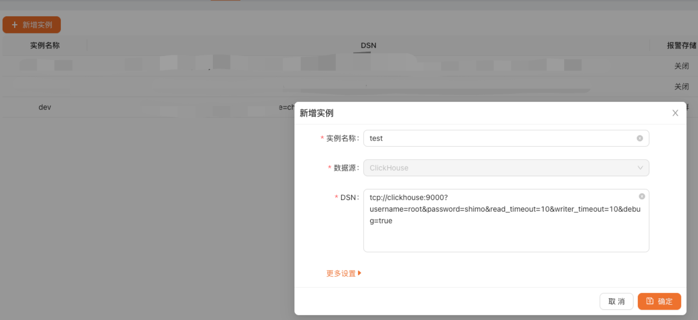

# Docker-Compose ClickVisual

This article mainly introduces how to use docker-compose to quickly launch clickVisual demo locally to experience the complete process of log generation, collection and query.

## 1. Basic information
- Project address：https://github.com/clickvisual/clickvisual
- Go to the ClickVisual UI at 'http://127.0.0.1:19001' with the initial account/password：clickvisual/clickvisual.
- Visist http://127.0.0.1:19002 to view Kafka data consumption details.
- Enter http://127.0.0.1:19003 ,it can simulate a real user accessing to nginx and generate an access log.
- MySQL connection port:13306,account/password：root/shimo
- ClickHouse port:8123，account/password：root/shimo


## 2.Demo Usage Guide
### 2.1. Start ClickVisual
- Clone clickvisual：
```bash
git clone https://github.com/clickvisual/clickvisual.git
```
- Execute in the root directory of the ClickVisual project：
```bash
docker-compose up
```
- Go to the login page at http://127.0.0.1:19001，account/password：clickvisual/clickvisual

### 2.2. Create Database
Create an instance and fill in the DSN parameter
```param
tcp://clickhouse:9000?username=root&password=shimo&read_timeout=10&write_timeout=10&debug=true
```


### 2.3. Create Log
- Create table：ingress_stdout
- _time_ field type: there are two types to select,string or float,in this demo it must be float.
- Log Retention Days: seven days
- Brokers: Fill in the access address of Kafka container started up by docker-compose: kafka:9092
 - Topic：Topic name of the collection log in Kafka: ingress-stdout


### 2.4 Simulated Access
Open your browser and access http://127.0.0.1:19003, you can see the output: hello，i'm clickvisual,at this moment Nginx has generated an access log.


Access http://localhost:19002/topics/ingress-stdout?o=-1&p=-1&q&s=50#messages， you can find the log from Kafka to make sure the log collection has been successful.Then switch to the Consumers Tab,you can find the logger_ingress_stdout consumer group,that means ClickHouse is consumering.


### 2.5. Query Logs
Access http://localhost:19001/query ,you can query Nginx Access Logs that just generated.


### 2.6. Index Management
If you don't create any index field, it will work slowly with fuzzy search.To improve search performance,you can create index fields in the following figure.


After the creation, we will access http://127.0.0.1:19003 again several times to  general several new access logs.By this, you can query the logs according to the index fields quickly.


