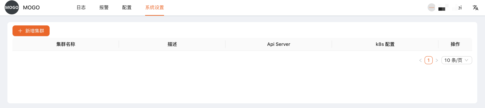
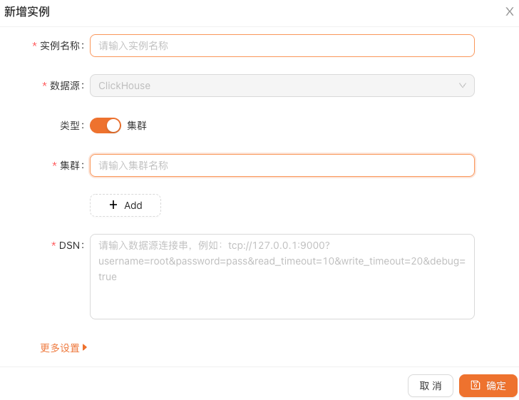

# 系统设置

完成 clickvisual 部署后，首先要做的是配置 Kubernetes 集群、配置 ClickHouse 数据源。

## 1. 集群配置管理

在顶部导航栏中，选择 **系统设置 -> 集群管理：**

由于我们尚未配置集群，此处列表为空。我们点击 **+新增集群**，在弹出表单中填入需要配置的集群信息，包括集群名称、API Server 地址、kube-config 配置等。

提交后即可在做 LogAgent 配置下发时使用。

## 2. ClickHouse 数据源管理

在顶部导航栏中，选择 **系统设置 -> 实例管理：**

默认没有配置数据源实例，所以此处为空，点击 **+新增实例**，增加一个新的 ClickHouse 实例作为数据源。

数据源配置类似：`tcp://x.x.x.x:9000?username=x&password=x&read_timeout=10&write_timeout=20&debug=true`，可支持参数

|参数| 类型    |
|---|-------|
|read_timeout| float |
|write_timeout| float |
|block_size| int   |
|compress| bool  |

配置好 `dev-clickhouse` 这个数据源后，稍后即可以在日志查询页面中使用。